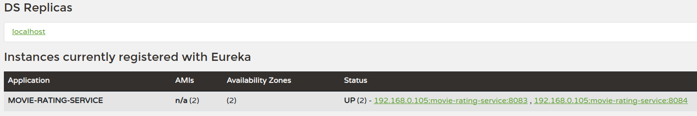

# Spring Boot Microservice example

Spring Boot 2.x example how to create small project with microservice architecture

## Description

Spring Boot 2.7.6, REST API, RestTemplate, Spring Cloud 2021.0.5, Eureka server, Actuator, Resilience4j

### Dependencies

* Java 11
* Gradle
* Build and run with Java 11
* You can registrate in https://www.themoviedb.org page
```
sudo update-alternatives --config java (select Java 11) 
```

## Components

### Service Discovery

* Use Netflix Eureka service registry to use client side load balancing and decouples service providers 

#### Installing
* Build application
```
gradle clean bootjar
```
#### Running
```
java -jar service-discovery-1.0.0.jar
```
#### Testing
* View the administrator UI the following URL
```
http://localhost:8787/
```

### Rating Service

* Get rating information of the selected movie

#### Installing
* Build application
```
gradle clean bootjar
```
#### Running application (in two instances)
```
java -jar -Dserver.port=8083 rating-service-1.0.0.jar
java -jar -Dserver.port=8084 rating-service-1.0.0.jar
```
#### Testing
* You can see two "rating-service" instance in Eureka admin UI


* You can check the Actuator health endpoints
```
http://192.168.0.105:8083/actuator/health
http://192.168.0.105:8084/actuator/health
```

* Get movie rating summary data by movie ID
```
http://192.168.0.105:8083/ratingsdata/1234
```

* Get user ratings list by user ID
```
http://192.168.0.105:8083/ratingsdata/users/9876
```

### Movie Info Service

* Get description of the selected movie via "api.themoviedb.org"

#### Installing
* Build application
```
gradle clean bootjar
```
#### Running
```
java -jar movie-info-service-1.0.0.jar
```
#### Testing
* You can see the "movie-info-service" in Eureka admin UI


* You can check the Actuator health endpoint
```
http://192.168.0.105:8082/actuator/health
```

* Get sample movie description
```
http://192.168.0.105:8082/movies/1234
```

### Movie Catalog Service

* Get movie catalog list with ratings (from rating-service), use service discovery and Resilience4J 

#### Installing
* Build application
```
gradle clean bootjar
```
#### Running
```
java -jar movie-catalog-service-1.0.0.jar
```
#### Testing
* You can see the "movie-catalog-service" in Eureka admin UI


* You can check the Actuator health endpoint
```
http://192.168.0.105:8081/actuator/health
```

* Get sample configuration parameters (from application.properties)
```
http://192.168.0.105:8081/catalog/config
```

* Get user ratings aggregate information (call movie-rating-service after that call movie-info-service)
```
http://192.168.0.105:8081/catalog/1234
```

* Some words how to use Resilience4J
```
application.yaml (extract)

resilience4j:
  circuitbreaker:
    instances:
      ratingService:
        registerHealthIndicator: true
        eventConsumerBufferSize: 10
        failureRateThreshold: 50
        minimumNumberOfCalls: 5
        automaticTransitionFromOpenToHalfOpenEnabled: true
        waitDurationInOpenState: 5s
        permittedNumberOfCallsInHalfOpenState: 3
        slidingWindowSize: 10
        slidingWindowType: COUNT_BASED
  retry:
    instances:
      ratingService:
        maxAttempts: 3
        waitDuration: 10000
  bulkhead:
    instances:
      ratingService:
        maxWaitDuration: 5000
        maxConcurrentCalls: 5
```

* You can use Resilience4J annotations in source code (com.example.movie.resources.MovieCatalogResource class):
  * Circuit Breaker
    ```
    @CircuitBreaker(name = "ratingService", fallbackMethod = "fallbackMethodForRatingService")
    ...
    ...
    public ResponseEntity<String> fallbackMethodForRatingService(Exception exception) {
        return ResponseEntity.status(HttpStatus.GATEWAY_TIMEOUT).body("This is the fallback method!");
    }
    ```    

  * Retry
    ```
    @Retry(name = "ratingService", fallbackMethod = "retryMethodForRatingService")
    ...
    ...
    public ResponseEntity<String> retryMethodForRatingService(Exception exception) {
      return ResponseEntity.status(HttpStatus.NOT_FOUND).body("This is the retry method!");
    }
    ```
    
  * Bulkhead
    ```
    @Bulkhead(name = "ratingService", fallbackMethod = "bulkHeadMethodForRatingService")
    ...
    ...
    public ResponseEntity<String> bulkHeadMethodForRatingService(Exception exception) {
        return ResponseEntity.status(HttpStatus.NOT_FOUND).body("This is the bulkhead method!");
    }
    ```  

## Author

Kenyeres Géza
https://hu.linkedin.com/in/g%C3%A9za-kenyeres-17341631
